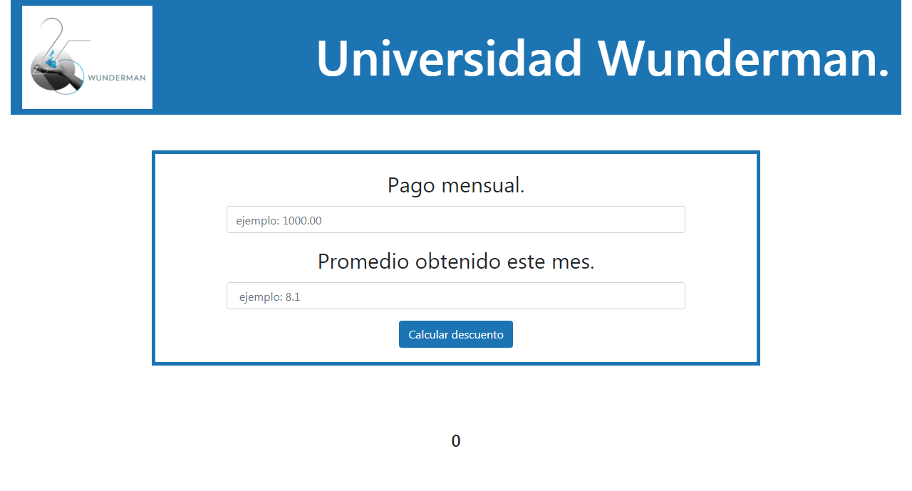

# Becas de la universidad Wunderman.

Becas de la  Universidad de Wunderman.
 
 - Es un proyecto de una calculadora, en la cual se solicita ingresar tu pago mensual y tu calificación. Se crea un calculo para saber si eres acreedor a alguna beca, en caso de que si, sale un texto de la información que tienes que pagar dependiendo de tu promedio.
En el se utilizo bootstrap, javascript, html5 y css3.

